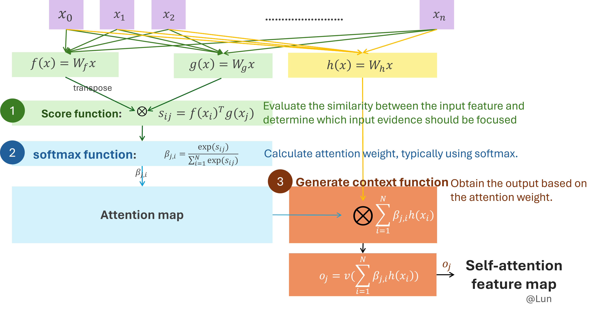

## Three steps to create self-attention feature map
</img>

## Reference
[10 Cutting Edge Research Papers In Computer Vision & Image Generation](https://www.topbots.com/most-important-ai-computer-vision-research/)\
[Spectral Normalization 谱归一化-原理及实现](https://www.cnblogs.com/wonderlust/p/15767225.html)\
[Non-local Neural Networks](https://arxiv.org/pdf/1711.07971v3.pdf)\
[遍地开花的 Attention，你真的懂吗？](https://zhuanlan.zhihu.com/p/77307258)\
[深度学习中的注意力机制](https://blog.csdn.net/tg229dvt5i93mxaq5a6u/article/details/78422216)\
[Attention 机制](https://easyai.tech/ai-definition/attention/)\
[详解GAN的谱归一化（Spectral Normalization） ](https://www.sohu.com/a/294399864_500659)\
[GAN的损失函数（转载）](https://www.cnblogs.com/hansjorn/p/15589277.html)\
